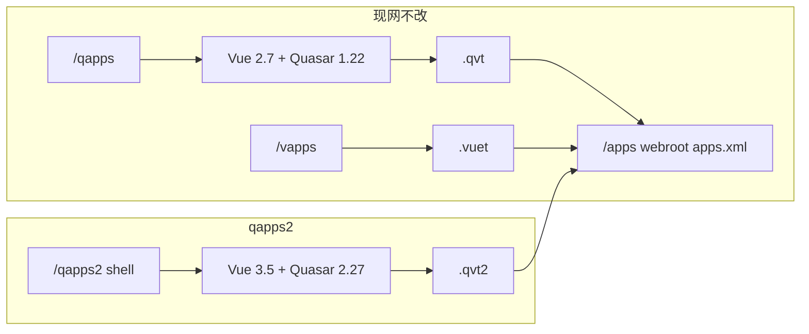

# qapps2 需求说明

Vue 3 + Quasar UI 2 并行入口。不修改现有 `/qapps`、`/vapps`、`/apps` 源文件。
与 `/qapps`、`/vapps` 一样共用业务屏树 `/apps`；独立的是壳、宏、vendor、render mode。

- 组件目录：`runtime/component/qapps2`
- 状态：组件已落地（`/qapps2` 壳、`/apps` 拉屏、`/qapps2static` vendor）
- 日期：2026-09-03

## 1. 背景

现网默认内部 UI 是 `/qapps`：服务端 FTL 把 XML Screen 编成 Vue 模板字符串，由全局 UMD 挂载。

| 项 | 现网 `/qapps` |
|----|----------------|
| Vue | 2.7.14（`webroot/libs/vue`） |
| Quasar | UI 1.22.10 UMD |
| 业务屏树 | `component://webroot/screen/webroot/apps.xml`（`/apps`） |
| 拉屏扩展名 | `.qvt` / `.qvue` / `.qjs` |
| 宏 | `runtime/template/screen-macro/DefaultScreenMacros.qvt.ftl` |

不存在 Quasar UI v3。2026 年的 `@quasar/app-vite` v3 是 CLI，本组件不用。目标栈为 **Vue 3.5 全量 UMD（带模板编译器）+ Quasar UI 2.27 UMD**。

不在现网代码上打补丁，避免和 `/vapps` 共用的 `/libs/vue` 互相踩踏，也便于本入口单独演进。

## 2. 目标

1. 新建本地组件 `qapps2`，与 qapps / vapps **入口、宏、vendor 独立**，业务屏树共用 `/apps`。
2. 保留 `/qapps` 为默认入口（不改 `webroot.xml` 的 `default-item`）。
3. 浏览器地址：`/qapps2/...`。
4. AJAX 基路径为 **`/apps`**（与 `/qapps`、`/vapps` 相同），新组件自动出现在菜单。
5. 自有 render mode：`qvt2` / `qvue2` / `qjs2`，宏与 vendor 都在本组件内。
6. 仍用 UMD + 服务端 FTL 运行时编译，不改成 Quasar CLI SPA。

## 3. URL 与数据流

| URL | 作用 |
|-----|------|
| `/qapps2` | Vue 3 壳（`confLinkBasePath`） |
| `/apps` | 共享业务屏树（`confBasePath`，拉屏） |
| `/qapps2static` | Vue 3 / Quasar 2 / 壳 JS/CSS |



示例：打开 `/qapps2/tools/Service/ServiceRun`，实际请求 `/apps/tools/Service/ServiceRun.qvt2`。

壳与静态资源通过 **本组件 `MoquiConf.xml`** 挂到 `component://webroot/screen/webroot.xml`，不改 webroot 源文件。业务应用仍挂在 `webroot/apps.xml` 上，不必为 qapps2 再挂一遍。

## 4. 共享树 vs 叶子屏

该独立的是壳、宏、vendor、render mode。屏树与 `/qapps` / `/vapps` 共用，这样 MarbleERP 等组件只需在自己的 `MoquiConf` 里挂 `apps.xml`。

`qvt2` 宏把 `type="qvt"` 当作兼容回退，现有业务屏 XML 不用为 qapps2 加一份 `qvt2` 文本。

独立屏树只在这两种情况再考虑：qapps2 要故意展示和 `/qapps` 不同的应用集；或要在不改原组件的前提下替换某模块整棵子树。

## 5. Render mode

`loadComponent` 用 URL 扩展名选宏。不能继续请求 `.qvt`，否则会吃到 Vue 2 的 `value` / `@input` / `slot=`。

本组件 `<screen-facade>` 注册：

| type | 宏 |
|------|-----|
| `qvt2` | `component://qapps2/template/screen-macro/DefaultScreenMacros.qvt2.ftl` |
| `qjs2` | `component://qapps2/template/screen-macro/DefaultScreenMacros.plain.ftl` |
| `qvue2` | 同上 |

壳：`moqui.urlExtensions = { js:'qjs2', vue:'qvue2', vuet:'qvt2' }`。

不改 `framework/.../MoquiDefaultConf.xml`。

## 6. 技术改造要点（副本内修改）

从现网 **复制** 后再改，不改原文件。

### 6.1 壳 JS（`WebrootVue.qvt2.js`）

- `createApp` + `app.use(Quasar, { config })` + `app.mount('#apps-root')`
- `Vue.component` → `app.component`；`Vue.prototype` → `app.config.globalProperties`
- 伪造 `$router` / `$route` 做成 Vue Router 4 的 `resolve()` 形状
- 过滤器改为 methods / `$filters`
- `value` + `$emit('input')` → `modelValue` + `update:modelValue`
- `beforeDestroy` → `beforeUnmount`；不用 `Vue.extend`
- `.qvue2` 用 vue3-sfc-loader，并传入同一个 `app`
- jQuery / Moment 尽量放在 `qapps2static`，少引用 webroot `/libs`

### 6.2 宏与 CSS

- `col-xs-*` → `col-*`
- `template slot=` → `v-slot:`
- `q-input` / `q-select` / `q-checkbox` / `q-tabs` / `q-expansion-item` 改为 `v-model` 或 `modelValue`
- `--q-color-*` → `--q-*`；按 Quasar 2 的 QBtn / QField DOM 改覆盖
- form-list 仍用 `q-table--*` class，不引入 `<q-table>`

### 6.3 导航与 Assist

- 将 SimpleScreens 的 `MyAccountNav.qvue`、`ActiveOrgNav.qvue`、`QuickSearch.qvue` **复制进本组件** 再适配（可保留 `module.exports`）
- 不改 tools `Assist.qvue` / WriteUiTool；挂 Assist.xml 时用 `.qvt2` 宏渲染
- QZ 打印本轮不迁

## 7. 明确不改

- `runtime/base-component/webroot/**`（含 `qapps.xml`、`WebrootVue.qvt.*`、`libs/vue`、`libs/quasar`、`build.gradle`）
- `runtime/template/screen-macro/DefaultScreenMacros.qvt.ftl`
- tools Assist 源文件
- `MoquiDefaultConf.xml`
- `/vapps`、`/apps` 行为与菜单

## 8. 建议目录

```
runtime/component/qapps2/
  build.gradle                  ← 下载 vendor、minify、合并 Combined*.min.js
  .gitignore                    ← libs/ 与 js/*.min.js
  component.xml
  MoquiConf.xml
  AGENTS.md
  doc/qapps2-requirements.md    ← 本文件
  data/Qapps2ThemeData.xml
  data/AppSeedData.xml
  screen/qapps2.xml
  screen/includes/WebrootVue.qvt2.ftl
  screen/qapps2static.xml
  screen/qapps2static/libs/     ← 构建生成（vue3 / quasar2 / jquery / moment / FA）
  screen/qapps2static/js/WebrootVue.qvt2.js
  screen/qapps2static/js/MoquiLib.js
  screen/qapps2static/css/WebrootVue.qvt2.css
  template/screen-macro/DefaultScreenMacros.qvt2.ftl
  template/screen-macro/DefaultScreenMacros.plain.ftl
```

首次或 `cleanAll` 后执行 `./gradlew :runtime:component:qapps2:build`（根 `./gradlew build` 也会跑）。生产加载 `CombinedBase.min.js` + `CombinedQvt2.min.js`。

主题：新枚举 `STT_INTERNAL_QUASAR2`、主题 `DEFAULT_QUASAR2`。

## 9. 验收

- `/qapps/tools/...` 与 `/apps/tools/...` 行为不变。
- `/qapps2/tools/Service/ServiceRun` 请求 `/apps/tools/Service/ServiceRun.qvt2`。
- `/qapps2/` 菜单与 `/qapps` 同级应用一致（Marble ERP、Tools 等）。
- 覆盖：菜单、ServiceRun、EntityDataFind、form-single/list、drop-down、date-time、dialog、暗色、侧栏、re-login。

## 10. 风险

- 组件 `MoquiConf` 的 `screen-text-output` 若未合并进 facade（少见），再评估是否只加框架 conf 三行；默认不改框架。
- 壳 JS / 宏与上游 qapps 会分叉；以本目录为唯一修改面，不回改 webroot。
- 不改 webroot `robots.txt`，本轮不把 `qapps2` 加入 disallow。
